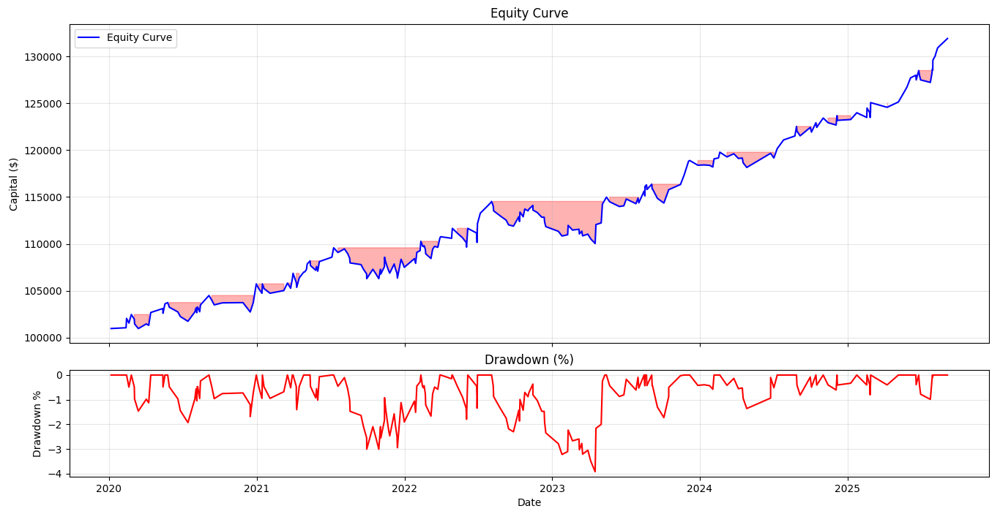
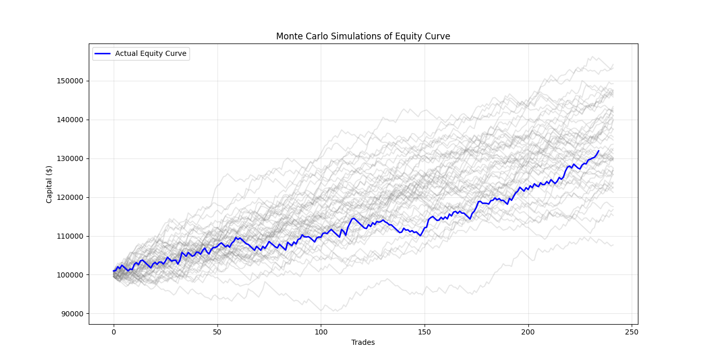
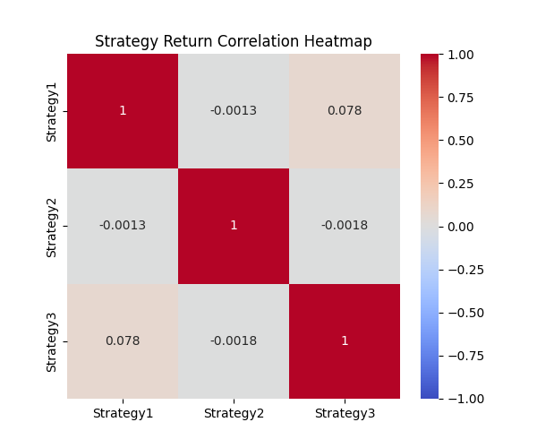
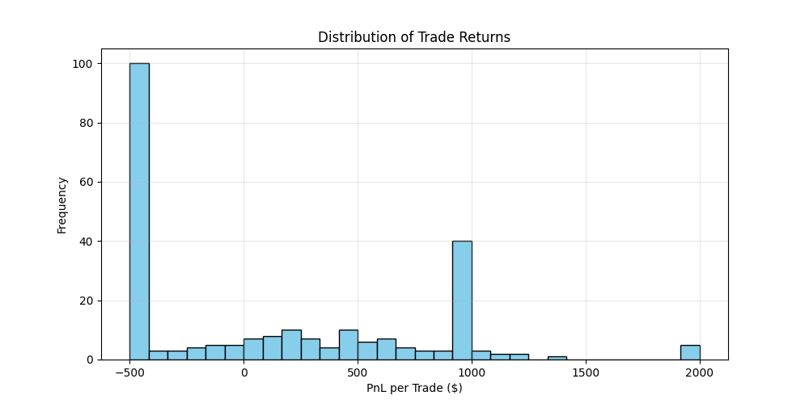

# 📊 Multi-Strategy Quant Backtester

This project implements a **multi-strategy backtesting framework** for FX trading on the **4H timeframe**.
It combines three independent price-action strategies with dynamic risk management and evaluates them through professional performance metrics, risk analysis, and Monte Carlo simulations.

🚀 **Goal:** Demonstrate quantitative research, portfolio thinking, and risk-adjusted evaluation of trading strategies.

----

## 🔑 Features

* Modular framework for multiple strategies
* Dynamic position sizing (fixed fractional risk)
* Trade log with entry/exit, stop-loss, target, and PnL
* Performance metrics: **Sharpe, Sortino, Calmar, CAGR, Max Drawdown**
* Equity curve & drawdown visualization
* Monte Carlo simulation of equity paths
* Correlation analysis between strategies
* Return distribution analysis (PnL histograms)

---

## 📈 Results (GBP/CHF 4H)

### Combined Performance

* **Initial Capital:** \$100,000
* **Final Capital:** \$130,425
* **Total Trades:** 160
* **Win Rate:** 54.4%
* **Sharpe Ratio:** 1.14
* **Sortino Ratio:** 1.14
* **Calmar Ratio:** 1.93
* **Max Drawdown:** -2.54%
* **Max Consecutive Losses:** 6

---

### 📊 Strategy-Level Metrics

| Metric           | Combined | S1     | S2     | S3     |
| ---------------- | -------- | ------ | ------ | ------ |
| Total Trades     | 160      | 95     | 29     | 36     |
| Win Rate (%)     | 54.37%   | 53.68% | 44.83% | 63.89% |
| Sharpe Ratio     | 1.14     | 0.54   | 0.39   | 1.04   |
| Sortino Ratio    | 1.14     | 0.40   | 3.83   | 4.99   |
| Calmar Ratio     | 1.93     | 0.44   | 0.55   | 2.88   |
| Max Drawdown (%) | -2.54%   | -3.70% | -1.51% | -0.99% |

---

## 📉 Visualizations

### Equity Curve & Drawdowns



### Monte Carlo Simulations



### Correlation Heatmap



### Trade Return Distribution



---

## 🔍 Key Insights

* **Diversification Benefit:** Low correlation across strategies reduces risk.
* **Robustness:** Monte Carlo confirms actual equity curve lies within the 5–95% percentile band.
* **Stability:** Max drawdown of only -2.54% makes it capital efficient.
* **Best Performer:** Strategy 3 had the strongest standalone performance (Sharpe 1.04, Sortino 4.99).
* **Return Distribution:** Histogram highlights trade-level asymmetry and presence of fat tails.

---

## ⚡ Next Steps

* Extend framework to multi-currency FX portfolio.
* Add volatility-scaling / Kelly position sizing.
* Expand strategy library to include trend-following and mean-reversion models.

---

## 📂 Repo Structure

```
MultiStrategy_Backtester/
│── README.md            # Research report (this file)
│── backtester.py        # Framework (risk mgmt, performance analytics)
│── strategy_example.py  # Dummy strategy (moving average crossover for demo)
│── figures/
│    ├── equity_&_drawdown.png
│    ├── monte_carlo.png
│    ├── correlation_heatmap.png
│    └── trade_histogram.png
```

---

## 📌 Note

This repo contains the **framework and sample strategies** only.
The proprietary logic of the real strategies has been excluded for confidentiality, but the backtester architecture and analytics remain identical.
